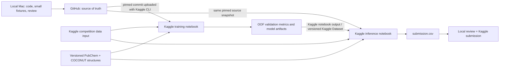

# Pipeline architecture: GitHub → Kaggle → submission

## Goal and operating constraints

Build a reproducible ranked-candidate pipeline for Enveda CASMI 2026. Input is one or more MS/MS spectra per `molecule_id`; output is one CSV row per molecule with up to 25 semicolon-separated SMILES, ordered for MRR@25. Evaluation ignores stereo and compares RDKit tautomer-canonicalized InChIKey14 connectivity. The downloadable `test.parquet` is a training-derived dummy; Kaggle replaces it with hidden natural-product-like spectra during the submission rerun. The local dummy is useful for schema and runtime checks only.

Available compute: Kaggle RTX PRO 6000 with 30 GPU hours/week and a MacBook Pro M3 with 8 GB RAM. Google Cloud Run is explicitly out of scope. Competition notebook commits require internet disabled and have a 9-hour execution limit. The full training parquet is too large for comfortable local loading, so the Mac is for development and small checks. Use Kaggle for full data work and neural training.

## Data flow



The committed competition run cannot `git clone` GitHub while internet is off. GitHub remains canonical; code is synchronized into Kaggle **before** the offline commit. Bundle the source into the notebook or publish it as a versioned Kaggle Dataset input, then use the Kaggle CLI locally (`kaggle kernels push`) to upload the notebook snapshot with input references. This is a GitHub-to-local-worktree-to-Kaggle upload, not a runtime GitHub pull. Record the Git commit SHA in notebook output. Never put Kaggle API tokens or credentials in GitHub.

## Repository structure

```text
.
├── README.md
├── PIPELINE_ARCHITECTURE.md
├── PLAN.md
├── requirements-kaggle.txt       # only dependencies not already in Kaggle image
├── src/
  │   ├── config.py                 # paths, bins, tolerances, seed, feature flags
│   ├── io_data.py                # parquet streaming/chunked reads and schemas
│   ├── chemistry.py              # RDKit standardization and InChIKey14
│   ├── spectra.py                # peak cleaning, binning, transforms
│   ├── audit_overlap.py          # exact dummy-test/train diagnostic
│   ├── make_folds.py             # metric-key-grouped fold assignments
│   ├── prepare_validation.py     # stream structure/source holdout parquet splits
│   ├── retrieve.py               # precursor-aware streaming spectral search
│   ├── evaluate_predictions.py   # validation MRR@25 and hit rates
│   ├── score.py                  # molecule-level reciprocal rank helpers
│   └── write_submission.py       # validate SMILES, IDs, top-25, connectivity dedup
├── notebooks/
│   └── 00_retrieval_baseline.ipynb
├── kaggle/
│   └── kernel-metadata.example.json # replace user and input dataset slugs
├── artifacts/                    # ignored locally; datasets/versioned outputs on Kaggle
└── reports/                       # metrics/config/commit SHA, no raw competition data
```

Do not commit competition parquet files, private keys, Kaggle tokens, or large generated indexes. Put large indexes and weights in versioned Kaggle notebook outputs or a private Kaggle Dataset. Keep artifacts traceable to source commit and training config.

## Pipeline stages

### 1. Data audit and leakage check

Read only required columns where possible. Verify schemas, nulls, formula/adduct distributions, molecule and spectrum counts, and peak-array alignment. The full local audit found 1,213/1,213 exact matches to `enveda-180` rows, covering 400/400 dummy-test molecules with no conflicting labels. This establishes that the visible file is a useful input/output smoke check; it provides no estimate of hidden-set score. Record the train file hash/version and check the organizer's update notice before experiments.

### 2. Validation design

Create two deterministic evaluation tracks:

- **Reference-available natural products:** Select query acquisitions for natural-product compounds, remove those exact rows from the reference library, and allow independent reference spectra of that compound. Exclude any exact duplicate acquisitions. This estimates cross-instrument and cross-energy library retrieval. Group all selected query acquisitions for one molecule together and score one ranked list.
- **Structure-held-out:** Group by InChIKey14 and remove every spectrum of each held-out structure from the reference library. Add source-held-out and scaffold-held-out stress slices. This estimates performance on novel compounds.

For both, compute molecule-level MRR@25, hit@1/5/25, candidate recall@25, and coverage by source, mode, adduct, formula size, and spectral quality. Add a same-formula isomer panel for database ranking. Save fold IDs, exclusions, candidate snapshot, and configuration with metrics. Keep both validation reports visible; the hidden novelty-class mixture is not disclosed.

### 3. Candidate generation baseline

Use a scalable indexed search, not all-pairs Python loops. Keep an exact spectrum hash for diagnostics and rare direct matches, but design for the hidden set's independent measurements. Apply precursor and adduct/mode constraints; formula is available only for reference structures and must be inferred or searched from hidden precursor data. Use sparse peak postings and multiple mass tolerances to produce a manageable candidate set. Score with modified cosine and neutral-loss similarity, aggregate query acquisitions and multiple reference spectra at molecule level, and deduplicate using metric-equivalent tautomer-normalized InChIKey14. The existing `src/retrieve.py` is a prototype and must be replaced before full-data inference.

### 4. Learned reranking

Generate out-of-fold candidate lists from the baseline. Fit a CPU pairwise/listwise ranker on query-candidate rows with positive = metric-equivalent matching InChIKey14 and hard negatives = same-formula / nearest-spectrum alternatives. Features include multi-tolerance cosine, precursor ppm, formula/adduct/mode compatibility, neutral-loss score, structure-aware fragment evidence, source/instrument priors, and query/reference quality. Evaluate on disjoint training, early-stopping, and final validation molecules. The ranker cannot improve candidate recall; if recall@25 is weak, fix candidate expansion first.

### 5. GPU model, only if it earns its cost

Train a spectrum encoder to predict molecular fingerprints from binned peaks using the Kaggle GPU. Learn from training compounds with compound-grouped validation. At inference, compare predicted fingerprint scores against formula-compatible candidates and blend with retrieval/ranker scores. Begin with a small run and early stopping; use the remaining GPU allocation only if grouped-fold MRR@25 improves beyond retrieval and ranker baselines. Use mixed precision and save resumable checkpoints.

### 6. Final inference and submission

Run inference using the exact pinned code, competition input, and chosen model artifact. Verify exactly one row per test molecule, required header (`molecule_id,smiles`), no nulls/duplicates, valid up-to-25 candidate count, semicolon serialization, valid RDKit SMILES, and no duplicate InChIKey14 candidates within a row. Save ranked candidates and diagnostics as notebook outputs; submit only `submission.csv`.

## GitHub and Kaggle handoff

1. Develop and review code on the Mac with tiny fixtures and synthetic spectra; push source to a GitHub repository. Keep data and large artifacts out of Git.
2. Pin a Git commit for each experiment. Use the Kaggle CLI locally to push the training notebook/code snapshot and attach the competition dataset as a notebook input. This is an upload before execution, not a runtime GitHub pull.
3. Run grouped validation and training in Kaggle. Kaggle GPU time is scarce: first spend CPU time on audit/index and retrieval, then GPU time only on the fingerprint model. Keep each committed notebook under 9 hours.
4. Export the winning ranker/model and metadata as a versioned Kaggle notebook output or Kaggle Dataset. Attach that artifact to the inference notebook. If artifact reuse is awkward, train and infer in one committed notebook only if the full run fits the time limit.
5. Push the inference notebook from the same Git commit, attach competition input and model-artifact input, disable internet, and commit/run. Pull the resulting `submission.csv` from Kaggle output, review it locally, then submit through Kaggle.
6. Record Git SHA, Kaggle notebook version, dataset version, fold metrics, and submission identifier in `reports/` for reproducibility.

## Resource allocation

| Resource | Use | Avoid |
|---|---|---|
| MacBook M3, 8 GB | Code, small samples, schema checks, synthetic fixtures, metric review | Full 2.5M-row materialization, full model/index builds |
| Kaggle CPU | Parquet scan, overlap audit, indexed library construction, grouped retrieval, tree ranker, final checks | Naive all-pairs scoring; repeatedly rebuilding identical artifacts |
| Kaggle RTX PRO 6000 (30 h/week) | GPU fingerprint/spectrum model, batched GPU inference | Spending GPU hours on sparse lookup or unproven architectures |
| Google Cloud Run | Not used | All preprocessing, training, artifact handling, and inference |

## Experiment gates

1. **Audit gate:** record train version, data quality, and the known dummy-test overlap; do not use dummy-test labels or statistics for model selection.
2. **Retrieval gate:** measure natural-product reference-available and structure-held-out candidate recall@25 and MRR@25; confirm scalable runtime/memory.
3. **Candidate gate:** measure PubChem/COCONUT coverage and same-formula isomer ranking before adding more structures.
4. **Reranker gate:** accept only repeatable molecule-level MRR gains across seeds/folds.
5. **Neural gate:** spend GPU time only if the neural model adds gains to the retrieval/ranker blend.
6. **Submission gate:** pass structural validation and reproduce selected metrics from the recorded commit/config.

The competition files are present locally. Only schema, counts, and exact dummy-test overlap have been measured so far; no training run or predictive validation score is claimed.
