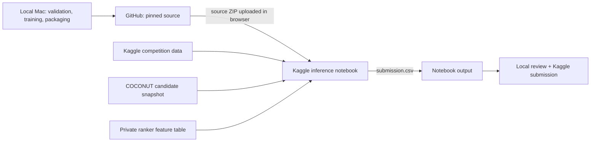

# Pipeline architecture: GitHub → Kaggle → submission

## Goal and operating constraints

Build a reproducible ranked-candidate pipeline for Enveda CASMI 2026. Input is one or more MS/MS spectra per `molecule_id`; output is one CSV row per molecule with up to 25 semicolon-separated SMILES, ordered for MRR@25. Evaluation ignores stereo and compares RDKit tautomer-canonicalized InChIKey14 connectivity. The downloadable `test.parquet` is a training-derived dummy; Kaggle replaces it with hidden natural-product-like spectra during the submission rerun. The local dummy is useful for schema and runtime checks only.

Available compute: MacBook Pro M3 with 8 GB RAM and Kaggle RTX PRO 6000 allocation. Google Cloud Run is explicitly out of scope. Do development, CPU reranker training, and validation on the Mac; GPU training is deferred until an experiment beats the CPU system on held-out groups. Kaggle notebook commits require internet disabled and have a 9-hour execution limit. Upload code and inputs through the Kaggle website; do not use Kaggle CLI.

## Data flow



The committed competition run cannot `git clone` GitHub while internet is off. GitHub remains canonical; code is synchronized into Kaggle **before** the offline commit. Run `scripts/package_kaggle_source.py`, create or update a private Kaggle Dataset through the website, and attach it in the notebook's Input panel. Upload and commit the notebook through Kaggle's website. Record the Git commit SHA in notebook output. Never put Kaggle API tokens or credentials in GitHub.

## Repository structure

```text
.
├── README.md
├── PIPELINE_ARCHITECTURE.md
├── PLAN.md
├── requirements-kaggle.txt       # only dependencies not already in Kaggle image
├── src/
  │   ├── config.py                 # paths, bins, tolerances, seed, feature flags
│   ├── io_data.py                # parquet streaming/chunked reads and schemas
│   ├── chemistry.py              # RDKit standardization and InChIKey14
│   ├── spectra.py                # peak cleaning, binning, transforms
│   ├── audit_overlap.py          # exact dummy-test/train diagnostic
│   ├── make_folds.py             # metric-key-grouped fold assignments
│   ├── prepare_validation.py     # stream structure/source holdout parquet splits
│   ├── retrieve.py               # precursor-aware streaming spectral search
│   ├── evaluate_predictions.py   # validation MRR@25 and hit rates
│   ├── score.py                  # molecule-level reciprocal rank helpers
│   └── write_submission.py       # validate SMILES, IDs, top-25, connectivity dedup
├── notebooks/
│   ├── 00_retrieval_baseline.ipynb
│   ├── 01_cpu_validation.ipynb
│   ├── 02_database_validation.ipynb
│   └── 03_final_inference.ipynb
├── kaggle/
│   └── kernel-metadata.example.json # replace user and input dataset slugs
├── scripts/
│   └── package_kaggle_source.py    # clean Git snapshot for private Kaggle input
├── artifacts/                    # ignored locally; datasets/versioned outputs on Kaggle
└── reports/                       # metrics/config/commit SHA, no raw competition data
```

Do not commit competition parquet files, private keys, Kaggle tokens, or large generated indexes. Put large indexes and weights in versioned Kaggle notebook outputs or a private Kaggle Dataset. Keep artifacts traceable to source commit and training config.

## Pipeline stages

### 1. Data audit and leakage check

Read only required columns where possible. Verify schemas, nulls, formula/adduct distributions, molecule and spectrum counts, and peak-array alignment. The full local audit found 1,213/1,213 exact matches to `enveda-180` rows, covering 400/400 dummy-test molecules with no conflicting labels. This establishes that the visible file is a useful input/output smoke check; it provides no estimate of hidden-set score. Record the train file hash/version and check the organizer's update notice before experiments.

### 2. Validation design

Create two deterministic evaluation tracks:

- **Reference-available natural products:** Select query acquisitions for natural-product compounds, remove those exact rows from the reference library, and allow independent reference spectra of that compound. Exclude any exact duplicate acquisitions. This estimates cross-instrument and cross-energy library retrieval. Group all selected query acquisitions for one molecule together and score one ranked list.
- **Structure-held-out:** Group by InChIKey14 and remove every spectrum of each held-out structure from the reference library. Add source-held-out and scaffold-held-out stress slices. This estimates performance on novel compounds.

For both, compute molecule-level MRR@25, hit@1/5/25, candidate recall@25, and coverage by source, mode, adduct, formula size, and spectral quality. Add a same-formula isomer panel for database ranking. Save fold IDs, exclusions, candidate snapshot, and configuration with metrics. Keep both validation reports visible; the hidden novelty-class mixture is not disclosed.

### 3. Candidate generation baseline

`src/retrieve.py` streams the training parquet and gates comparisons by ion mode and neutral precursor mass before spectral cosine and neutral-loss scoring. It aggregates spectra at molecule level and deduplicates to the competition metric. On the Mac, full-data source validation completed in about six minutes. Keep it as the high-confidence route for structures with matching library evidence; the strict structure holdout scored zero, as expected when truth structures are absent from the library.

### 4. Learned reranking

The current CPU HistGradientBoosting reranker uses mass error, one-bond fragment evidence, and molecular descriptors. It improves candidate order on internal held-out groups and a small external COCONUT pilot. The ranker cannot improve candidate recall; if recall@25 is weak, fix candidate expansion first.

### 5. GPU model, only if it earns its cost

Train a spectrum encoder to predict molecular fingerprints from binned peaks using the Kaggle GPU. Learn from training compounds with compound-grouped validation. At inference, compare predicted fingerprint scores against formula-compatible candidates and blend with retrieval/ranker scores. Begin with a small run and early stopping; use the remaining GPU allocation only if grouped-fold MRR@25 improves beyond retrieval and ranker baselines. Use mixed precision and save resumable checkpoints.

### 6. Final inference and submission

Run inference using the exact pinned code, competition input, COCONUT snapshot, and compatible CPU reranker artifacts. Keep spectral candidates first; `src/blend_predictions.py` uses reranker candidates only to fill vacant top-25 slots. The same-query validation preserved MRR and raised hit@25 by 0.004 on the 250-structure source slice. Verify one row per test molecule, required header (`molecule_id,smiles`), no nulls/duplicates, up to 25 semicolon-separated valid structures, and no duplicate InChIKey14 candidates. Save ranked candidates and diagnostics as notebook outputs; submit only `submission.csv`.

## GitHub and Kaggle handoff

1. Develop and review code on the Mac with tiny fixtures and synthetic spectra; push source to a GitHub repository. Keep data and large artifacts out of Git.
2. Pin a Git commit and build the source snapshot. Upload it as a private Kaggle Dataset using the browser, then attach that dataset and competition data in the notebook Input panel.
3. Run grouped validation and inference in Kaggle. Use GPU time only for a later fingerprint model that passes the validation gate. Keep each committed notebook under 9 hours.
4. Upload the private ranker-training feature table, COCONUT candidate source, and (only if Kaggle's installed version differs) pinned RDKit wheel as Kaggle Dataset inputs.
5. Upload and commit `03_final_inference.ipynb` through Kaggle's website, attach competition and asset inputs, disable internet, and run. The notebook fits the final CPU ranker, generates both prediction routes, and validates `submission.csv`. Download the output, review it locally, then submit through Kaggle.
6. Record Git SHA, Kaggle notebook version, dataset version, fold metrics, and submission identifier in `reports/` for reproducibility.

## Resource allocation

| Resource | Use | Avoid |
|---|---|---|
| MacBook M3, 8 GB | Streaming parquet scans, candidate filtering, CPU reranker, validation, Git packaging | Full in-memory materialization; GPU neural training |
| Kaggle CPU | Hidden-test inference if the Mac runtime or notebook limit requires it | Naive all-pairs scoring; repeatedly rebuilding identical artifacts |
| Kaggle RTX PRO 6000 allocation | Reserved for a future spectrum-to-fingerprint pilot after CPU gates | Spending GPU hours on sparse lookup or unproven architectures |
| Google Cloud Run | Not used | All preprocessing, training, artifact handling, and inference |

## Experiment gates

1. **Audit gate:** record train version, data quality, and the known dummy-test overlap; do not use dummy-test labels or statistics for model selection.
2. **Retrieval gate:** source holdout is measured at MRR@25 0.9261; strict structure holdout is 0.000 for library-only retrieval. Confirm runtime/memory on final inference.
3. **Candidate gate:** the COCONUT pilot is measured on 46 held-out targets; add a broader independent candidate set before relying on class-2 performance.
4. **Reranker gate:** accept only repeatable molecule-level MRR gains across seeds/folds.
5. **Neural gate:** spend GPU time only if the neural model adds gains to the retrieval/ranker blend.
6. **Submission gate:** pass structural validation and reproduce selected metrics from the recorded commit/config.

The competition files are present locally. CPU source/structure holdouts, internal and external candidate reranking, and the conservative fallback blend have been measured on the Mac. The visible test remains a dummy and is only for schema/runtime validation; hidden-set performance is not known.
